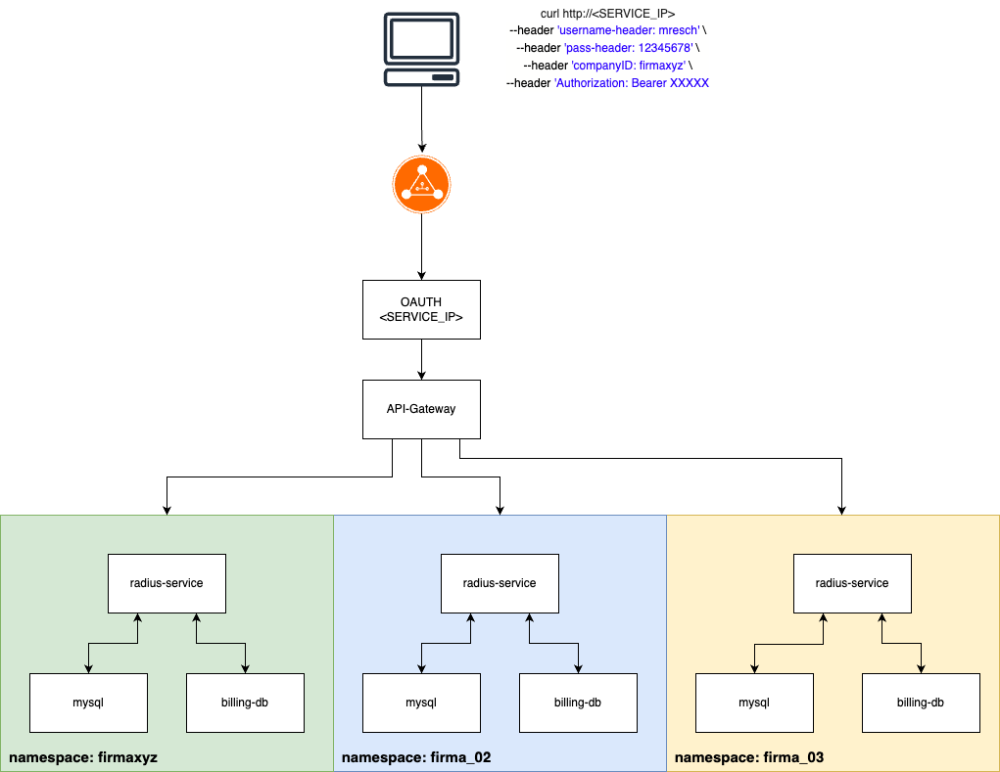

# K8S Radius Projekt

## Die Basis

Wir Philipp Palatin, Alexander Prantl, Christoph Hiess und Maximilian Resch erweitern, basierend auf dem Projekt des 1. Semesters einen "fake" Radius Service der zum Beginn folgende Komponenten enthält:

- 3 Mikroservices
  
  - radius-service
  
  - mysql (Benutzer Datenbank)
  
  - billing-db

Dieser Service kann als single Tenant in einem Kubernetes Cluster deployt werden

## Die Erweiterungen

Folgende Erweiterungen die im Zuge des 2. Semester gefordert werden sind geplant:

- OAuth - Authentifizierte Anfragen

- Tenant Fähigkeit

- Deployment eines neuen Tenants mittels "one-click" (eine Aktion ist erlaubt)

- Bereitstellung des Kubernetes Clusters mittels IaC

Da im technischen Sinne ein Radius Service bereits ein Authentifizierungs Service ist, stellt unser Konzept kein "real life" Szenario da, aber die Mitglieder der Gruppe lernen die Kubernetes Servcies, Implementierung und Bereitstellung eines Clusters kennen.

**WICHTIG**: Ein Radius-Service befindet sich in einem privaten, abgeschotteten Netzwerk des Providers. Die Authentifizierungsdaten (wie in der Archtiektur ersichtlich "username-header", "pass-header") werden zwischen einem BNG (Broadband Network Gateway) und dem Radius ausgetauscht. Daher ist eine unverschlüsselte Übertragung der Benutzerdaten "möglich". In einem echten System gibt es noch mehrere andere Sicherheitsfunktionen die wir hier nicht abbilden.

## Die neue Architektur

Die geplante neue Architektur beinhaltet alle oben erwähnten und geforderten Bestandteile. Neben dem OAuth Service der authentifizierte Anfragen ermöglich, wird die "Tenant Fähigkeit" mittels Radius deployments in getrennten Namespaces erfolgen. Jede neue Firma (ein neuer Kunden von uns) bekommt einen eigenen Namespace mit den 3 Mikroservices die mittels eines Eintrages im Request Header "company" durch das API-Gateway an den richtigen Namespace weitergeleitet wird.





### Infrastruktur Bereitstellung

Die Bereitstellung der Core Infrastruktur, also Managed Kubernetes, Block Storage, Worker Nodes und Loadbalancer erfolgt mittels IaC openTofu in der Exoscale Cloud.

Alle nötigen Ressourcen inklusive dem OAuth und API-Gateway werden dadurch erstellt. Ebenfalls wird ein Namespace mit dem Namen "testCompany" erstellt und die Radius Anwendung deployt, damit gleich nach der Bereitstellung ein manuell Service Check durchgeführt werden kann.


### "one click" Deployment

Mittels einer GitHub Action, die als Paramter den Namen der Firma entgegen nimmt und diesen danach als Referenz für den Namespace nimmt, wird das Deployment in den Kubernetes Cluster durchgeführt. Die notwendigen daten wie der Auth Token wird in der GitHub Aktion ausgegeben und dem Kunden auf einem sicheren weg zur Verfügung gestellt.


## Offene Fragen an Thomas

1. Müssen wir ArgoCD verwenden?

2. Ist der Umfang der Idee genug und alle Themen abgedeckt?


## Installieren und konfigurieren

Benötigte Software und Key's

- OpenTofu ([https://opentofu.org]())

- kubectl CLI

- Exoscale API Key

### Cluster vorbereiten

Das GitHub Repo klonen/runterladen und in dessen root Verzeichnis wechseln.

In der terraform.tfvars Datei die Exoscale API Keys eintragen.

Mittels OpenTofu den Cluster "planen" und "applyen"

```bash
tofu plan 
```

```bash
tofu apply
```

Nachdem der Cluster erfolgreich erstellt wurde, kann die kubeconfig zur Steuerung des Clusters verwendet werden. Entweder mittels übergabe der kubeconfig Datei bei jedem kubectl Befehl

```bash
kubectl --kubeconfig /path/to/kubeconfig.yaml get pods
```

oder man kopiert den Inhalt der kubeconfig in die Datei "config" im Ordner ".kube".

Für die weiteren Schritte wurde die config Datei erstellt um die kubectl Befehle schlanker zu halten.

Damit die GitHub Action auch kubectl Befehle ausführen kann muss im GitHub Repo unter "**Settings**" -> "**Secrets and variables**" -> "**Repository secrets**" das Secret "EXOSCALE_KUBECONFIG" erstellt/ausgetauscht und eine BASE64 Variante der kubeconfig eingefügt werden.

Mit folgendem Befehl kann eine BASE64 Version erstellt werden

```bash
openssl base64 -in kubeconfig -out kubeconfig_base64
```


### OAuth und API-Gateway deployen

> ✅ NEU: Einfach die Action "Deploy Exoscale SKS with OpenTofu" ausführen 🥳

> ⚠️ Deprecated! Wurde jetzt mit einer GitHub Action automatisiert umgesetzt!

Damit der OAuth Proxy und das API-Gateway erstellt werden, müssen zwei Deplyoments angewendet werden.

```bash
kubectl apply -f oauth-proxy/
```

und

```bash
kubectl apply -f api-gateway/
```

Danach überprüfen ob alles Pods dieser zwei Deployments und der restlichen K8S Infrastruktur laufen:

```bash
kubectl get pods --all-namespaces
```


### GitHub Workflow starten

Damit ein Namespace mit dem Radius Service erstellt wird, muss nur mit einem Klick die GitHub Action im Repo -> "**Actions**" -> "**Deploy new Namespace to Exoscale Kubernetes**" ausgeführt werden. Dafür ist die Eingabe des Unternehmennames nötig (dieser ist dann auch der Name des Namespaces)

Sobald der Workflow erfolgreich durchgelaufen ist, überprüfen ob alle Deployments des Radius Service laufen

```bash
kubectl get pods -n [gewählter-unternehmenname]
```


### Service Testen

> ⚠️ ~~Aktuelle Einschränkung: Der LoadBalancer funktioniert noch nicht, somit ist der OAuth Service von "außen" noch nicht erreichbar. Daher ist der Umweg über port-forward nötig~~

> ✅ Einschränkung mit PR Feature/oauthproxy #5 gefixed. Somit kann die Anfrage an die Public IP Port 80 gesendet werden

Damit Anfragen an den OAuth-Proxy gesendet werden muss der port-forward durchgeführt werden

```bash
kubectl port-forward deployment/oauth2-proxy 8080:4180 
```

Da wir eine Authentifizierte Anfrage stellen die der OAuth-Proxy prüft, muss ein gültiger Maschine-to-Maschine Token erstellt werden

```bash
TOKEN=$(curl -s -X POST \
  https://dev-agov026zrx5oi6bw.eu.auth0.com/oauth/token \
  -H 'Content-Type: application/json' \
  -d '{
    "client_id":"OLmNQTGjwZaiTcuCWnSFu64l5B2pPCXp",
    "client_secret":"XXXXX",
    "audience":"https://dev-agov026zrx5oi6bw.eu.auth0.com/api/v2/",
    "grant_type":"client_credentials"
  }' | jq -r .access_token)
```

Das "client_secret" ist hier versteckt, dieses gibt es auf Nachfrage beim Projektteam.

Danach den Token anzeigen lassen

```bash
echo $TOKEN
```

Jetzt ist es mögich eine curl Anfrage an den Service zu senden um die gewünschten Daten zurück zu bekommen

```bash
curl --location 'http://localhost:8080' \
--header 'username-header: mresch' \
--header 'pass-header: 12345678' \
--header 'companyID: [gewählter-unternehmenname]' \
--header 'Authorization: Bearer
```

> ⚠️ bei "companyID" muss der Name des gewählten Wertes der GitHub Action eingetragen werden (Unternehemsnamen)
> 
> Der Token muss als "Authorization: Bearer" eingetragen sein

Als Antwort kommt dann mit diesem Beispiel folgende Antwort zurück

```json
{
    "status": 200,
    "data": {
        "header": "mresch",
        "user_data": [
            [
                1,
                "mresch",
                "12345678",
                100,
                300,
                "fw-100",
                1
            ]
        ],
        "billing_status": "Paid"
    }
}
```


## Bereits bekannte Probleme

Hier beschreiben wir Probleme die uns bereits bekannt sind und mögliche Lösungsansätze

<table>
  <tr>
    <th>Problem</th>
    <th>Kurzbeschreibung</th>
    <th>Status</th>
  </tr>
  <tr>
    <td>Worker Node Performance</td>
    <td>Ressourcen Limit bei mehreren Deployments</td>
    <td>✅</td>
  </tr>
  <tr>
    <td>Block Storage notwendig</td>
    <td>PVC Error - Storage Plugin fehlerhaft</td>
    <td>✅</td>
  </tr>
  <tr>
    <td>OAuth Proxy ohne UI</td>
    <td>Authentifizierung ohne UI ermöglichen</td>
    <td>✅</td>
  </tr>
</table>

### Worker Node Performance

**Problem**

Mit dem Code der 1 Node IaC Übung aus der PT stoßen wir an die Kapazitätsgrenzen des einen Nodes beim Deployment eines weiteren Namespaces

**Lösung**

Mehrere Nodes verwenden, allerdings hat Exoscale ein Limit in der Trail Version


### Block Storage notwendig

**Problem**

Die Datenbanken benötigen einen Block Storage auf denen die Daten liegen. Beim Deployment der Mysql Datenbanken kommt ein PVC fehler

**Lösung**

Exoscale CSI Plugin installieren. Mittels des IaC openTofu Eintrags "exoscale_csi = true" wird in dem SKS das Storage Plugin aktiviert.


### OAuth Proxy ohne UI

**Problem**

OAuth Proxy bietet eine tolle Möglichkeit mittels unterschiedlicher Auth Provider, authentifizierte Anfragen zu erstellen. Diese sind alle UI basiert was in unserer Architektur nicht vorgesehen ist.

**Lösung**

Wir setzen auf die "Machine to Machine" Tokens die druch eine curl Anfrage an den Service generiert werden können. Mittels dieser Token lassen sich authentifizierte Requests erstellen.
